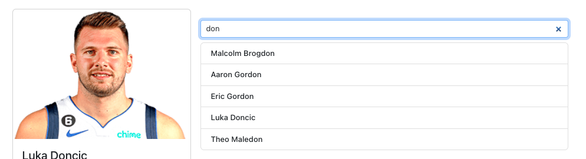
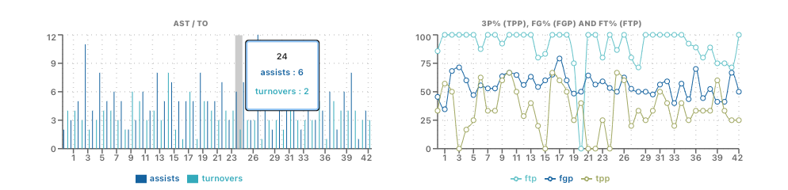
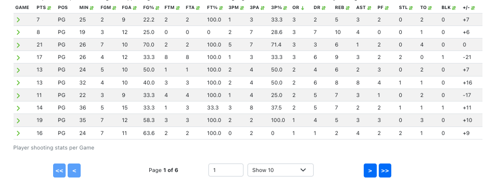
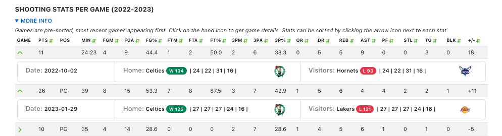

# BSE NBA PROJECT

Welcome to the BSE NBA PROJECT, a basketball data interaction and visualization web application that allows you to easily search for and view NBA player statistics. The app offers a variety of features for exploring player performance data from the 2022-2023 season, including sorting, chart visualizations, and game details.

Check out the [Live Demo](https://nba-analysis.onrender.com/players/265) to explore the app!

---

- [BSE NBA PROJECT](#bse-nba-project)
    - [WALKTHROUGH](#walkthrough)
      - [Player Search](#player-search)
      - [Player Statistics (CHARTS)](#player-statistics-charts)
      - [Player Statistics (TABLE)](#player-statistics-table)
      - [Game Details](#game-details)
    - [DESIGN DOCS](#design-docs)
      - [Tech Stack:](#tech-stack)
      - [Data Sources:](#data-sources)
    - [FUTURE TODOs](#future-todos)
      - [Features:](#features)
      - [Data:](#data)
      - [Backend:](#backend)
      - [Authentication:](#authentication)
      - [UI / display:](#ui--display)
      - [UX:](#ux)
      - [Performance:](#performance)
      - [Site Reliability:](#site-reliability)
    - [SETUP](#setup)

---

### WALKTHROUGH

The app offers several key features for exploring player statistics, including:

#### Player Search
**Search** for a player by typing his last name, for example:

Search for a player by typing their last name. For example, searching for `doncic` will return `Luka Doncic`, while `don` will return all players with a last name that contains `don`.

#### Player Statistics (CHARTS)
Key player statistics are displayed in **charts** for improved visualization. Hovering over a bar (right chart) or a dot (left chart) provides a list of statistics for that game.

#### Player Statistics (TABLE)
Player statistics are displayed per game in the **table**, from most recent to oldest. All statistics can be **sorted** to easily compare and find highs and lows for each player.

#### Game Details
Clicking on a row in the player statistics table displays additional information on the game, including the date, teams, scores, and line scores.

### DESIGN DOCS

#### Tech Stack:
This project was built on `vitejs` using the `react-ts` framework.
I wanted to build a visual, highlt interactive frontend showcasing using `reactjs`, `JavaScrip` and `TypeScript`.

#### Data Sources:
As a casual basketball fan and by no means a sports analytics expert, it wasn't initially clear what data and statistics would matter most to a decision-maker in the NBA. To determine this, I did research on YouTube, looked at online resources (NBA, ESPN, FiveThirtyEight, Basketball Reference, etc.), and interviewed a sports analytics expert who had worked at MSG. In the end, I felt that a tool that shows a wide range of statistics and allows easy sorting of the data would be the most useful.

I decided to forego building a backend due to project scope and time constraints and instead fetch NBA-related data from `RapidAPI`'s `NBA-API`* with `axios`.

Some data is also saved locally in `JSON`, from `NBAData.net` to bypass CORS same-origin-policy issues. The latter is only used to fetch players IDs to get their respective profile image source URL.

Data is from the "2022-2023" NBA season for this project. However, the code could easily be modified to allow multi-season data for historical comparisons.

*Please allow some time between calls. This project runs on the free subscription tier and is limited on throttling, the number of calls per minute, and calls per day.

---

### FUTURE TODOs

Additional features that could be added to the project include:

#### Features:
- Allow users to select between seasons for comparison purposes.
- Further features to allow more in-depth analysis in this player analysis model:
  - Allow users to compare different players against each other.
  - Allow users to compare player vs. team.
  - Allow users to compare player vs. other similar players.

#### Data:
- This project encountered a significant blocker due to limited data access and a lack of expertise about existing tools in the world of basketball. For the scope of this demo project, data was fetched from RapidAPI's NBA-API using Axios. However, this has drawbacks if used for professional competitive applications, such as cost, downtime, stale data, etc. To address this, some options include:
  - Further research data sources to find more reliable, consistent data
  - Build a web crawler for specific types of data
  - Build a backend to access ESPN/NBA/etc. data that is updated and refreshed regularly
  - Collaborate with the sports analytics/data analytics team to research pertinent data sources and assess data relevancy.

#### Backend:
- Currently, this project does not have a full backend. However, in future versions, building a backend could enable several additional features, such as:
  - Authentication for users to add comments, save/share data, and collaborate
  - Data management with databases, such as fetching and storing data from APIs and manipulating data

#### Authentication:
- Adding authentication to this project would allow users to add comments, save/share data, and collaborate.

#### UI / display:
- Currently, this project's chart visualization allows users to view data at a high level but could be improved with additional features such as zooming in and out.
- Additionally, the horizontal scroll of the player stats table can be difficult to use on smaller screens, so this can be improved in future versions.

#### UX:
- In future versions, it would be helpful to display game details without having to manually expand each row in the player stats table. However, this may require rethinking the table layout, as it is already very dense. One potential solution could be splitting the table into smaller tables.
- The current navbar displays teams but does not navigate anywhere, so future versions could include navigation to teams > players | team data & stats.
- Additionally, future versions could allow users to add notes or flag certain stats/games/players for further analysis.

#### Performance:
- Improving performance is an ongoing priority for this project. Code splitting and lazy loading were implemented to reduce load times, and further deconstruction of components can be done to optimize performance further.

#### Site Reliability:
- Future versions of this project will include additional testing for quality assurance and more robust error handling to gracefully handle API/data fetch errors. One example of missing data is that RapidAPI's NBA-API does not have team and season data for Isaiah Thomas.

---

### SETUP
In the project directory, run:

- `npm install` to download dependencies
- `npm run dev` to run dev mode on your local server

Note: this project requires `.env` variables to run correctly
